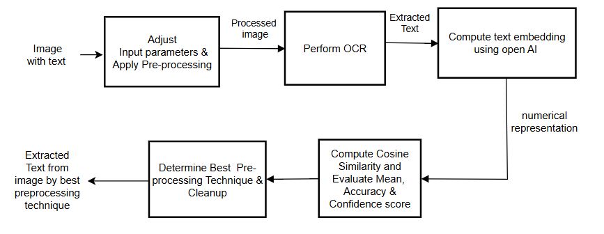

# Table of Contents

1. [Project Overview](#project-overview)
2. [Methodology](#methodology)
   - [Image Preprocessing](#image-preprocessing)
     - [Rotation and Resize](#rotation-and-resize)
     - [CannyFilter and Invert](#cannyfilter-and-invert)
     - [Grayscale and Binarization](#grayscale-and-binarization)
     - [Grayscale, Binarization, and Resize](#grayscale-binarization-and-resize)
     - [Invert](#invert)
     - [HSI Adjustment](#hsi-adjustment)
     - [Mirror](#mirror)
   - [Optical Character Recognition (OCR)](#optical-character-recognition-ocr)
   - [Text Embedding](#text-embedding)
   - [Similarity Computation](#similarity-computation)
   - [Performance Evaluation](#performance-evaluation)
   - [Final Selection](#final-selection)


# Project Overview

Our project follows a structured approach for extracting, analyzing, and evaluating text from images, as illustrated in [Figure 1](#figure1). The methodology consists of multiple stages aimed at optimizing Optical Character Recognition (OCR) accuracy and determining the most effective preprocessing techniques for reliable text extraction.

<p align="center">
  
</p>
<p align="center"><i>Figure 1: Block diagram representing the workflow of OCR</i></p>

## Methodology

The process involves the following stages:

1. ## **Image Preprocessing**: 
   - The raw image undergoes various transformations such as rotation, thresholding, and resizing to enhance the quality of text extraction. Different preprocessing techniques are combined to get the most effective one in [`PreprocessingFactory`](Source/OCRApplication/OCRApplication/Preprocesssing/PreprocessingFactory.cs)

    1. ## [`Rotation`](Source/OCRApplication/OCRApplication/Preprocesssing/RotateImage.cs) combined with [`Resize`](Source/OCRApplication/OCRApplication/Preprocesssing/ResizeImage.cs)

   ```csharp 
   case "rotation":
    // Apply rotation to the image for different angles and resize variations

    foreach (float angle in rotateAngles)
    {
        variation = $"rotated_{angle}";
        outputImagePath = $"{outputDir}/{variation}.jpg";
        var rotatedImg = RotateImage.ApplyRotation(imagePath, outputImagePath, angle);

        foreach (int targerDPI in targerDPIs)
        {
            variation = $"rotated_{angle}_resized_{targerDPI}";
            outputImagePath = $"{outputDir}/{variation}.jpg";
            ResizeImage.ResizingImage(rotatedImg, outputImagePath, targerDPI);
            processedImages[variation] = outputImagePath;
        }
    }
    break;
   ```
   2. ## [`CannyFilter`](Source/OCRApplication/OCRApplication/Preprocesssing/CannyFilter.cs) combined with [`Invert`](Source/OCRApplication/OCRApplication/Preprocesssing/InvertImage.cs)

   ```csharp 
    case "cannyfilter":
    // Apply Canny edge detection and invert the resulting image

    foreach (int threshold in thresholds)
    {
        variation = $"cannyfilter_{threshold}";
        outputImagePath = $"{outputDir}/{variation}.jpg";
        var cannyImage = CannyFilter.ApplyCannyEdgeDetection(imagePath, outputImagePath, threshold);

        variation = $"cannyfilter_{threshold}_invert";
        outputImagePath = $"{outputDir}/{variation}.jpg";
        InvertImage.InvertingImage(cannyImage, outputImagePath);
        processedImages[variation] = outputImagePath;
    }
    break;
   ```

   3. ## [`Grayscale`](Source/OCRApplication/OCRApplication/Preprocesssing/Grayscale.cs) combined with [`Binarization`](Source/OCRApplication/OCRApplication/Preprocesssing/Binarization.cs)

   ```csharp
   case "denoise":
    // Convert image to grayscale
    variation = "grayscale";
    outputImagePath = $"{outputDir}/{variation}.jpg";
    var imgGray = Grayscale.ConvertToGrayscale(imagePath, outputImagePath);

    // Denoise image
    variation = "grayscale_binarized";
    outputImagePath = $"{outputDir}/{variation}.jpg";
    Binarization.ApplyOtsuBinarization(imgGray, outputImagePath);
    processedImages[variation] = outputImagePath;
    break;
    ```

    4. ## [`Grayscale`](Source/OCRApplication/OCRApplication/Preprocesssing/Grayscale.cs) combined with [`Binarization`](Source/OCRApplication/OCRApplication/Preprocesssing/Binarization.cs) and with [`Binarization`](Source/OCRApplication/OCRApplication/Preprocesssing/ResizeImage.cs)

    ```csharp
    case "chainfilter":
    // Apply a sequence of filters: grayscale -> binarization -> resize
    variation = "grayscale";
    outputImagePath = $"{outputDir}/{variation}.jpg";
    var grayImg = Grayscale.ConvertToGrayscale(imagePath, outputImagePath);

    variation = "grayscale_binarize";
    outputImagePath = $"{outputDir}/{variation}.jpg";
    var binImg = Binarization.ApplyOtsuBinarization(grayImg, outputImagePath);

    foreach (int targerDPI in targerDPIs)
    {
        variation = $"grayscale_binarize_resized_{targerDPI}";
        outputImagePath = $"{outputDir}/{variation}.jpg";
        ResizeImage.ResizingImage(binImg, outputImagePath, targerDPI);
        processedImages[variation] = outputImagePath;
    }
    break;
    ```

    5. ## [`Invert`](Source/OCRApplication/OCRApplication/Preprocesssing/InvertImage.cs)

    ```csharp
    case "invert":
    // Invert the image
    variation = "inverted";
    outputImagePath = $"{outputDir}/{variation}.jpg";
    InvertImage.InvertingImage(imagePath, outputImagePath);
    processedImages[variation] = outputImagePath;
    break;
    ```

    6. ## [`Hue Saturation Intensity Adjustment`](Source/OCRApplication/OCRApplication/Preprocesssing/HistogramAdjustment.cs)

    ```csharp
    case "hsi_adjustment":
    // Apply Histogram Adjustment with different saturation and intensity factors

    foreach (double sat in satFactors)
    {
        foreach (double intensity in intensityFactors)
        {
            variation = $"hsi_s{sat}_i{intensity}";
            outputImagePath = $"{outputDir}/{variation}.jpg";
            HistogramAdjustment.ApplyHistogramAdjustment(imagePath, outputImagePath, sat, intensity);
            processedImages[variation] = outputImagePath;
        }
    }
    break;
    ```

    7. ## [`Mirror`](Source/OCRApplication/OCRApplication/Preprocesssing/MirrorImage.cs)

    ```csharp
     case "mirror_horizontal":
     // Mirror the image horizontally
     variation = "mirror";
     outputImagePath = $"{outputDir}/{variation}.jpg";
     MirrorImage.Process(imagePath, outputImagePath);
     processedImages[variation] = outputImagePath;
     break;
     ```

2. ## **Optical Character Recognition (OCR)**: 
   - Tesseract OCR technology is used to extract text from the preprocessed image. The goal is to maximize OCR accuracy by optimizing the preprocessing techniques used in the previous stage. The OCR process involves three main steps: segmentation, character recognition, and confidence scoring. [`TextExtraction`](Source/OCRApplication/OCRApplication/Services/TextExtraction.cs)

3. ## **Text Embedding**: 
   - The extracted text is then converted into embeddings using OpenAI text embedding model, specifically text-embedding-ada-002. This step helps in transforming the text into a numerical representation known as an embedding. These embeddings capture the semantic meaning of the text, enabling accurate comparisons between different OCR outputs. [`TextEmbedding`](Source/OCRApplication/OCRApplication/Services/TextEmbedding.cs)

4. ## **Similarity Computation**: 
   - We calculate the similarity of the extracted text between different preprocessing technique variations. This allows for evaluating how well the OCR process has performed, A higher similarity score [`0 < similarity score < 1`] indicates that the OCR result is more semantically similar. [`TextSimilarity`](Source/OCRApplication/OCRApplication/Services/TextSimilarity.cs)

5. ## **Performance Evaluation**: 
   - The performance of different preprocessing techniques is evaluated by comparing the OCR results. This stage helps in selecting the best approach for image text extraction. 
   
   - Additionally, we compute dictionary accuracy, which determines the proportion of recognized words that exist in a predefined dictionary. This metric helps assess OCR performance by filtering out incorrectly recognized words.
     
   - Furthermore, the mean confidence score is calculated by averaging the confidence levels assigned by the OCR engine to each word. A high confidence score indicates that the OCR engine is more certain about its text recognition. [`TextAnalysis`](Source/OCRApplication/OCRApplication/Services/TextAnalysis.cs)

   ```csharp
   string dictionaryPath = UtilityClass.DictionaryPath();
    // Load English dictionary from file
    HashSet<string> dictionary = LoadDictionary(dictionaryPath);

    using (var iter = page.GetIterator())
    {
     iter.Begin();
        do
        {
            if (iter.IsAtBeginningOf(PageIteratorLevel.Word))
            {
                string? word = iter.GetText(PageIteratorLevel.Word)?.Trim();
                float confidence = iter.GetConfidence(PageIteratorLevel.Word);

                if (!string.IsNullOrEmpty(word) && confidence > 0)
                {
                    totalWords++;
                    confidences.Add(confidence);

                    // Check if the word exists in dictionary
                    if (dictionary.Contains(word.ToLower()))
                    {
                        correctWords++;
                    }
                }
            }
        } while (iter.Next(PageIteratorLevel.Word));
    }

    // Calculate metrics
    float meanConfidence = totalWords > 0 ? (float)confidences.Average() /100 : 0;
    float dictionaryAccuracy = totalWords > 0 ? (float)correctWords / totalWords : 0;
    ```
   - The above Dictionary Accuracy and Mean Confidence Score for each Technique are stored in [`ExtractedTextMeanConfidence.csv`](Source/OCRApplication/OCRApplication/Output/Tesseract_Output/ExtractedTextMeanConfidence.csv) file.

   - We Calculate the Mean Cosine Similarity of each technique compared with other techniques from the [`CosineSimilarityMatrix.csv`](Source/OCRApplication/OCRApplication/Output/Cosine_Similarity_Output/CosineSimilarityMatrix.csv) file. Top N Tecniques based on input parameter Max are then selected by eleminating false/low similarity.

   - Later we sort the selected N Techniques first by DictionaryAccuracy and then by MeanConfidenceScore in descending order after combining above two .csv results.

    [`Results.cs`](Source/OCRApplication/OCRApplication/Helpers/Results.cs)
   ```csharp
    // Select top N techniques based on Mean Cosine Similarity
    var results = new List<(string Technique, double Mean)>();

    foreach (var line in lines.Skip(1)) // Skip header
    {
      var parts = line.Split(',');
      string technique = parts[0];
      var values = parts.Skip(1).Select(s => double.Parse(s)).ToList();
       double mean = values.Average();
      results.Add((technique, mean));
    }
    var top = results.OrderByDescending(r => r.Mean).Take(max);

    // Merge top results with dictionary accuracy and mean confidence
    var topWithAccuracy = top
    .Join(records,
          result => result.Technique,
          record => record.Technique,
          (result, record) => new
          {
              result.Technique,
              result.Mean,
              record.DictionaryAccuracy,
              record.MeanConfidence
          })
    .OrderByDescending(r => r.DictionaryAccuracy)    // Sort first by Dictionary Accuracy
    .ThenByDescending(r => r.MeanConfidence)       // Then by Mean Confidence
    .Take(max).ToList();

    ```

6. ## **Final Selection**: 
   - Based on the performance evaluations, the best preprocessing technique is chosen to ensure reliable text extraction from the images. 

    [`Results.cs`](Source/OCRApplication/OCRApplication/Helpers/Results.cs)
    ```csharp
    // Best technique
    var bestTechnique = topWithAccuracy.First();
    ```
    - A final step of eliminating false similarity is to check whether the selected Technique has greater than 0 DictionaryAccuracy. If not then, the selected N Techniques are re-evaluated and now top N are selected based on DictionaryAccuracy of all the techniques sorted in descending order.

    ```csharp
    if (bestTechnique.DictionaryAccuracy == 0)
    {
     Console.WriteLine("The above Techniques have 0 Dictionary Accuracy, hence eliminating false similarity.");
     topWithAccuracy = records.Where(r => r.DictionaryAccuracy > 0).Join(results,
             result => result.Technique,
             record => record.Technique,
            (result, record) => new
              {
                result.Technique,
                record.Mean,
                result.DictionaryAccuracy,
                result.MeanConfidence
            }).OrderByDescending(r => r.DictionaryAccuracy).ThenByDescending(r => r.MeanConfidence).Take(max).ToList();
     if (topWithAccuracy.Count != 0)
     {
         bestTechnique = topWithAccuracy.First();
     }
    }
    ```   

Each stage is carefully designed to ensure that the OCR process yields high-quality and accurate text extraction, and that the most effective preprocessing technique is selected for future use.


