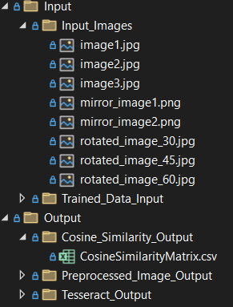

# Getting Started

## Steps to run the console app

1. **Install Dependencies**
   - Install .NET 8 and Visual Studio Code IDE.

2. **Clone the Application**
   ```sh
   git clone https://github.com/Babz-30/TextExtractionAPI_Team_TechRookies.git
   ```

3. **Install NuGet Packages, Clean, and Build**
   - Install all required NuGet Packages.
   - Clean and build the application.

4. **Set Launch Profile with Environment Variable**
   - Name: `authtoken`
   - Value: `Bearer {Your OpenAI Key}`
   
   **Note:** This is used for computing text embeddings.

5. **Load the Image for Text Extraction**
   - Place the image in the following folder:
     ```
     TextExtractionAPI_Team_TechRookies\Source\OCRApplication\OCRApplication\Input\Input_Images
     ```

6. **Modify `appsettings.json`**
   - Set the image file name and adjust preprocessing settings:
   ```json
   {
     "InputImage": "image1.jpg",
     "PreprocessingSettings": {
       "RotateAngles": [ -45.0, -30.0, -20.0, 20.0, 30.0, 45.0 ],
       "Thresholds": [ 50, 150, 200 ],
       "TargetDPIs": [ 50, 100, 200, 300 ],
       "SatFactors": [ 2.0, 1.5, 0.5 ],
       "IntensityFactors": [ 2.0, 1.5, 0.5 ]
     }
   }
   ```

7. **Run the Application**
   - Execute the application in the terminal.

8. **View the Results**
   - The extracted text is displayed on the console.
   - Processed files are stored in the output folder:
     ```
     TextExtractionAPI_Team_TechRookies\Source\OCRApplication\OCRApplication\Output
     ```
   - **Output Folders:**
     - `Output\Preprocessed_Image_Output` → Contains all preprocessed images.
     - `Output\Tesseract_Output` → Extracted text in `.txt` files and computational metrics in `.csv`.
     - `Output\Cosine_Similarity_Output` → `CosineSimilarityMatrix.csv` for similarity analysis.

## Directory Structure
Below is an example of the directory structure for input and output files:


