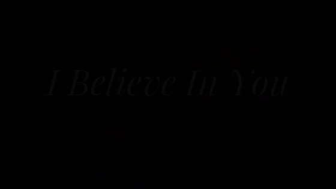
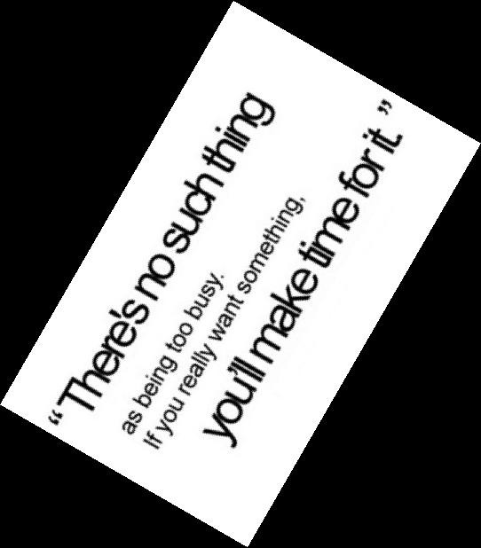
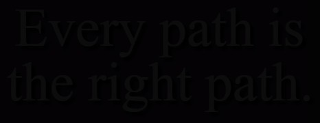

# Results

## Navigation
- [Image1](#image1)
- [Image2](#image2)
- [Image2](#image3)
- [Image2](#image4)
- [Image2](#image5)
- [Image2](#image6)
- [Image2](#image7)
- [Image2](#image8)

---

## Image1

### Original Image


### Configuration (appsettings.json)
```json
{
  "InputImage": "image1.jpg",
  "PreprocessingSettings": {
    "RotateAngles": [ -90.0, -60.0, -45.0, -30.0, -20.0, -10.0, 10.0, 20.0, 30.0, 45.0, 60.0, 90.0, 180.0 ],
    "Thresholds": [ 50, 150, 200, 250 ],
    "TargetDPIs": [ 50, 100, 200, 300 ],
    "SatFactors": [ 20.0, 10, 5.0, 0.5, 0.2 ],
    "IntensityFactors": [ 20.0, 5.0, 0.5, 0.2 ]
  },
  "Max": 10,
  "API_URL": "https://api.openai.com/v1/embeddings",
  "EMBEDDING_MODEL": "text-embedding-ada-002",
  "MEDIA_TYPE": "application/json"
}
```

### Console Output


### Metrics


### Graph Representation


---

## Image2

### Original Image


### Configuration (appsettings.json)
```json
{
  "InputImage": "image2.jpg",
  "PreprocessingSettings": {
    "RotateAngles": [ -90.0, -60.0, -45.0, -30.0, -20.0, -10.0, 10.0, 20.0, 30.0, 45.0, 60.0, 90.0, 180.0 ],
    "Thresholds": [ 50, 150, 200, 250 ],
    "TargetDPIs": [ 50, 100, 200, 300 ],
    "SatFactors": [ 20.0, 10.0, 5.0, 2 ],
    "IntensityFactors": [ 20.0, 10.0, 5.0, 2 ]
  },
  "Max": 30,
  "API_URL": "https://api.openai.com/v1/embeddings",
  "EMBEDDING_MODEL": "text-embedding-ada-002",
  "MEDIA_TYPE": "application/json"
}
```

### Console Output


### Metrics


### Graph Representation


---

## Image3

### Original Image


### Configuration (appsettings.json)
```json
{
  "InputImage": "image3.jpg",
  "PreprocessingSettings": {
    "RotateAngles": [ -90.0, -60.0, -45.0, -30.0, -20.0, -10.0, 10.0, 20.0, 30.0, 45.0, 60.0, 180.0 ],
    "Thresholds": [ 50, 150, 200, 250 ],
    "TargetDPIs": [ 50, 100, 200, 300 ],
    "SatFactors": [ 20.0, 10, 5.0, 0.5, 0.2 ],
    "IntensityFactors": [ 20.0, 5.0, 0.5, 0.2 ]
  },
  "Max": 30,
  "API_URL": "https://api.openai.com/v1/embeddings",
  "EMBEDDING_MODEL": "text-embedding-ada-002",
  "MEDIA_TYPE": "application/json"
}
```

### Console Output


### Metrics


### Graph Representation


---

## Image4

### Original Image


### Configuration (appsettings.json)
```json
{
  "InputImage": "image4.jpg",
  "PreprocessingSettings": {
    "RotateAngles": [ -90.0, -60.0, -45.0, -30.0, -20.0, -10.0, 10.0, 20.0, 30.0, 45.0, 60.0, 180.0 ],
    "Thresholds": [ 50, 150, 200, 250 ],
    "TargetDPIs": [ 50, 100, 200, 300 ],
    "SatFactors": [ 20.0, 10, 5.0, 0.5, 0.2 ],
    "IntensityFactors": [ 20.0, 5.0, 0.5, 0.2 ]
  },
  "Max": 30,
  "API_URL": "https://api.openai.com/v1/embeddings",
  "EMBEDDING_MODEL": "text-embedding-ada-002",
  "MEDIA_TYPE": "application/json"
}
```

### Console Output


### Metrics


### Graph Representation


---

## Image5

### Original Image


### Configuration (appsettings.json)
```json
{
  "InputImage": "image5.jpg",
  "PreprocessingSettings": {
   "RotateAngles": [ -90.0, -60.0, -45.0, -30.0, -20.0, -10.0, 10.0, 20.0, 30.0, 45.0, 60.0, 180.0 ],
   "Thresholds": [ 50, 150, 200, 250 ],
   "TargetDPIs": [ 50, 100, 200, 300 ],
   "SatFactors": [ 20.0, 10, 5.0, 0.5, 0.2 ],
   "IntensityFactors": [ 20.0, 5.0, 0.5, 0.2 ]
 },
  "Max": 30,
  "API_URL": "https://api.openai.com/v1/embeddings",
  "EMBEDDING_MODEL": "text-embedding-ada-002",
  "MEDIA_TYPE": "application/json"
}
```

### Console Output


### Metrics


### Graph Representation


---

## Image6

### Original Image


### Configuration (appsettings.json)
```json
{
  "InputImage": "image6.png",
  "PreprocessingSettings": {
   "RotateAngles": [ -90.0, -60.0, -45.0, -30.0, -20.0, -10.0, 10.0, 20.0, 30.0, 45.0, 60.0, 180.0 ],
   "Thresholds": [ 50, 150, 200, 250 ],
   "TargetDPIs": [ 50, 100, 200, 300 ],
   "SatFactors": [ 20.0, 10, 5.0, 0.5, 0.2 ],
   "IntensityFactors": [ 20.0, 5.0, 0.5, 0.2 ]
  },
  "Max": 30,
  "API_URL": "https://api.openai.com/v1/embeddings",
  "EMBEDDING_MODEL": "text-embedding-ada-002",
  "MEDIA_TYPE": "application/json"
}
```

### Console Output


### Metrics


### Graph Representation


---

## Image7

### Original Image


### Configuration (appsettings.json)
```json
{
  "InputImage": "image7.png",
  "PreprocessingSettings": {
    "RotateAngles": [ -90.0, -60.0, -45.0, -30.0, -20.0, -10.0, 10.0, 20.0, 30.0, 45.0, 60.0, 180.0 ],
    "Thresholds": [ 50, 150, 200, 250 ],
    "TargetDPIs": [ 50, 100, 200, 300 ],
    "SatFactors": [ 20.0, 10, 5.0, 0.5, 0.2 ],
    "IntensityFactors": [ 20.0, 5.0, 0.5, 0.2 ]
  },
  "Max": 30,
  "API_URL": "https://api.openai.com/v1/embeddings",
  "EMBEDDING_MODEL": "text-embedding-ada-002",
  "MEDIA_TYPE": "application/json"
}
```

### Console Output


### Metrics


### Graph Representation


---

## Image8

### Original Image


### Configuration (appsettings.json)
```json
{
  "InputImage": "image8.jpg",
  "PreprocessingSettings": {
    "RotateAngles": [ -90.0, -60.0, -45.0, -30.0, -20.0, -10.0, 10.0, 20.0, 30.0, 45.0, 60.0, 90.0, 180.0 ],
    "Thresholds": [ 50, 150, 200, 250 ],
    "TargetDPIs": [ 50, 100, 200, 300 ],
    "SatFactors": [ 20.0, 10, 5.0, 0.5, 0.2 ],
    "IntensityFactors": [ 20.0, 5.0, 0.5, 0.2 ]
  },
  "Max": 30,
  "API_URL": "https://api.openai.com/v1/embeddings",
  "EMBEDDING_MODEL": "text-embedding-ada-002",
  "MEDIA_TYPE": "application/json"
}
```

### Console Output


### Metrics


### Graph Representation
