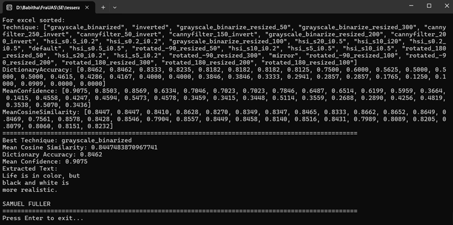
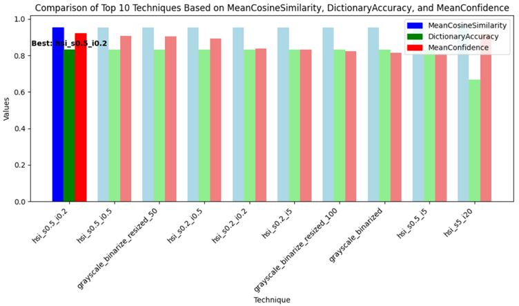
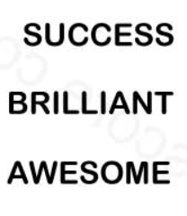
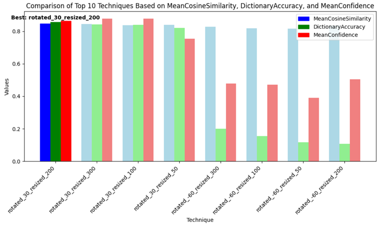
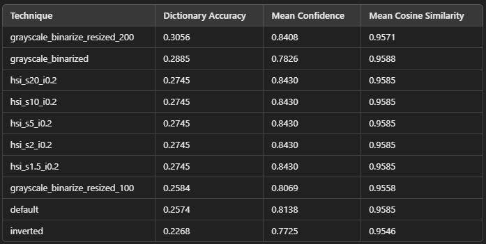
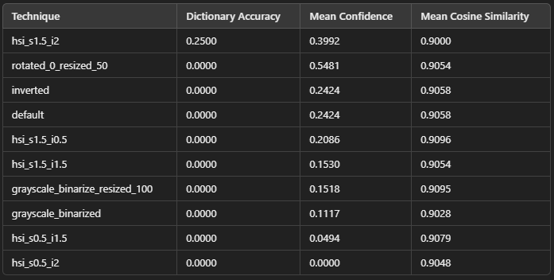

# Results

## Navigation
- [Image1 Test](#image1-test)
- [Image2 Low Saturation](#image2-low-saturation)
- [Image3 Inverted](#image3-inverted)
- [Image4 Rotated clockwise 60°](#image4-rotated-clockwise-60)
- [Image5 Low Intensity](#image5-low-intensity)
- [Image6 Mirror Flipped Text](#image6-mirror)
- [Image7 Coloured](#image7-coloured)
- [Image8 Rotated clockwise 30°](#image8-rotated-clockwise-30)
- [Image9 Bill misaligned Rotated anti-clockwise 45°](#image9-bill-misaligned)
- [Image10 Bill](#image10-bill)
- [Image11 Passport](#image11-passport)
- [Image12 License Plate](#image12-license-plate)

---

## Image1 Test

### Original Image
<p align="center">
  
</p>
<p align="center"><i>Fig.1.1 Input Image1 Test</i></p>

### Configuration (appsettings.json)
```json
{
  "InputImage": "image1.jpg",
  "PreprocessingSettings": {
    "RotateAngles": [ -90.0, -60.0, -45.0, -30.0, -20.0, -10.0, 10.0, 20.0, 30.0, 45.0, 60.0, 90.0, 180.0 ],
    "Thresholds": [ 50, 150, 200, 250 ],
    "TargetDPIs": [ 50, 100, 200, 300 ],
    "SatFactors": [ 20.0, 10, 5.0, 0.5, 0.2 ],
    "IntensityFactors": [ 20.0, 5.0, 0.5, 0.2 ]
  },
  "Max": 10,
  "API_URL": "https://api.openai.com/v1/embeddings",
  "EMBEDDING_MODEL": "text-embedding-ada-002",
  "MEDIA_TYPE": "application/json"
}
```

### Processed Image
<p align="center">
  
</p>
<p align="center"><i>Fig.1.2 Best Processed Image1</i></p>

### Console Output
<p align="center">
  
</p>
<p align="center"><i>Fig.1.3 Image1 console output</i></p>

### Metrics
<p align="center">
  
</p>
<p align="center"><i>Fig.1.4 Image1 output metrics</i></p>

### Graph Representation
<p align="center">
  
</p>
<p align="center"><i>Fig.1.5 Image1 output graph</i></p>

---

## Image2 Low Saturation

### Original Image
<p align="center">
  
</p>
<p align="center"><i>Fig.2.1 Input Image2 Low Saturation</i></p>

### Configuration (appsettings.json)
```json
{
  "InputImage": "image2.jpg",
  "PreprocessingSettings": {
    "RotateAngles": [ -90.0, -60.0, -45.0, -30.0, -20.0, -10.0, 10.0, 20.0, 30.0, 45.0, 60.0, 90.0, 180.0 ],
    "Thresholds": [ 50, 150, 200, 250 ],
    "TargetDPIs": [ 50, 100, 200, 300 ],
    "SatFactors": [ 20.0, 10.0, 5.0, 2 ],
    "IntensityFactors": [ 20.0, 10.0, 5.0, 2 ]
  },
  "Max": 30,
  "API_URL": "https://api.openai.com/v1/embeddings",
  "EMBEDDING_MODEL": "text-embedding-ada-002",
  "MEDIA_TYPE": "application/json"
}
```

### Processed Image
<p align="center">
  
</p>
<p align="center"><i>Fig.2.2 Best Processed Image2</i></p>

### Console Output
<p align="center">
  
</p>
<p align="center"><i>Fig.2.3 Image2 console output</i></p>

### Metrics
<p align="center">
  
</p>
<p align="center"><i>Fig.2.4 Image2 output metrics</i></p>

### Graph Representation
<p align="center">
  
</p>
<p align="center"><i>Fig.2.5 Image2 output graph</i></p>

---

## Image3 Inverted

### Original Image
<p align="center">
  
</p>
<p align="center"><i>Fig.3.1 Input Image3 Inverted</i></p>

### Configuration (appsettings.json)
```json
{
  "InputImage": "image3.jpg",
  "PreprocessingSettings": {
    "RotateAngles": [ -90.0, -60.0, -45.0, -30.0, -20.0, -10.0, 10.0, 20.0, 30.0, 45.0, 60.0, 180.0 ],
    "Thresholds": [ 50, 150, 200, 250 ],
    "TargetDPIs": [ 50, 100, 200, 300 ],
    "SatFactors": [ 20.0, 10, 5.0, 0.5, 0.2 ],
    "IntensityFactors": [ 20.0, 5.0, 0.5, 0.2 ]
  },
  "Max": 30,
  "API_URL": "https://api.openai.com/v1/embeddings",
  "EMBEDDING_MODEL": "text-embedding-ada-002",
  "MEDIA_TYPE": "application/json"
}
```

### Processed Image
<p align="center">
  
</p>
<p align="center"><i>Fig.3.2 Best Processed Image3</i></p>

### Console Output
<p align="center">
  
</p>
<p align="center"><i>Fig.3.3 Image3 console output</i></p>

### Metrics
<p align="center">
  
</p>
<p align="center"><i>Fig.3.4 Image3 output metrics</i></p>

### Graph Representation
<p align="center">
  
</p>
<p align="center"><i>Fig.3.5 Image3 output graph</i></p>

---

## Image4 Rotated clockwise 60°

### Original Image
<p align="center">
  
</p>
<p align="center"><i>Fig.4.1 Input Image4 Rotated clockwise 60°</i></p>

### Configuration (appsettings.json)
```json
{
  "InputImage": "image4.jpg",
  "PreprocessingSettings": {
    "RotateAngles": [ -90.0, -60.0, -45.0, -30.0, -20.0, -10.0, 10.0, 20.0, 30.0, 45.0, 60.0, 180.0 ],
    "Thresholds": [ 50, 150, 200, 250 ],
    "TargetDPIs": [ 50, 100, 200, 300 ],
    "SatFactors": [ 20.0, 10, 5.0, 0.5, 0.2 ],
    "IntensityFactors": [ 20.0, 5.0, 0.5, 0.2 ]
  },
  "Max": 30,
  "API_URL": "https://api.openai.com/v1/embeddings",
  "EMBEDDING_MODEL": "text-embedding-ada-002",
  "MEDIA_TYPE": "application/json"
}
```

### Processed Image
<p align="center">
  
</p>
<p align="center"><i>Fig.4.2 Best Processed Image4</i></p>

### Console Output
<p align="center">
  
</p>
<p align="center"><i>Fig.4.3 Image4 console output</i></p>

### Metrics
<p align="center">
  
</p>
<p align="center"><i>Fig.4.4 Image4 output metrics</i></p>

### Graph Representation
<p align="center">
  
</p>
<p align="center"><i>Fig.4.5 Image4 output graph</i></p>

---

## Image5 Low Intensity

### Original Image
<p align="center">
  
</p>
<p align="center"><i>Fig.5.1 Input Image5 Low Intensity</i></p>

### Configuration (appsettings.json)
```json
{
  "InputImage": "image5.jpg",
  "PreprocessingSettings": {
   "RotateAngles": [ -90.0, -60.0, -45.0, -30.0, -20.0, -10.0, 10.0, 20.0, 30.0, 45.0, 60.0, 180.0 ],
   "Thresholds": [ 50, 150, 200, 250 ],
   "TargetDPIs": [ 50, 100, 200, 300 ],
   "SatFactors": [ 20.0, 10, 5.0, 0.5, 0.2 ],
   "IntensityFactors": [ 20.0, 5.0, 0.5, 0.2 ]
 },
  "Max": 30,
  "API_URL": "https://api.openai.com/v1/embeddings",
  "EMBEDDING_MODEL": "text-embedding-ada-002",
  "MEDIA_TYPE": "application/json"
}
```

### Processed Image
<p align="center">
  
</p>
<p align="center"><i>Fig.5.2 Best Processed Image5</i></p>

### Console Output
<p align="center">
  
</p>
<p align="center"><i>Fig.5.3 Image5 console output</i></p>

### Metrics
<p align="center">
  
</p>
<p align="center"><i>Fig.5.4 Image5 output metrics</i></p>

### Graph Representation
<p align="center">
  
</p>
<p align="center"><i>Fig.5.5 Image5 output graph</i></p>

---

## Image6 Mirror

### Original Image
<p align="center">
  
</p>
<p align="center"><i>Fig.6.1 Input Image6 Mirror Flipped Text</i></p>

### Configuration (appsettings.json)
```json
{
  "InputImage": "image6.png",
  "PreprocessingSettings": {
   "RotateAngles": [ -90.0, -60.0, -45.0, -30.0, -20.0, -10.0, 10.0, 20.0, 30.0, 45.0, 60.0, 180.0 ],
   "Thresholds": [ 50, 150, 200, 250 ],
   "TargetDPIs": [ 50, 100, 200, 300 ],
   "SatFactors": [ 20.0, 10, 5.0, 0.5, 0.2 ],
   "IntensityFactors": [ 20.0, 5.0, 0.5, 0.2 ]
  },
  "Max": 30,
  "API_URL": "https://api.openai.com/v1/embeddings",
  "EMBEDDING_MODEL": "text-embedding-ada-002",
  "MEDIA_TYPE": "application/json"
}
```

### Processed Image
<p align="center">
  
</p>
<p align="center"><i>Fig.6.2 Best Processed Image6</i></p>

### Console Output
<p align="center">
  
</p>
<p align="center"><i>Fig.6.3 Image6 console output</i></p>

### Metrics
<p align="center">
  
</p>
<p align="center"><i>Fig.6.4 Image6 output metrics</i></p>

### Graph Representation
<p align="center">
  
</p>
<p align="center"><i>Fig.6.5 Image6 output graph</i></p>

---

## Image7 Coloured

### Original Image
<p align="center">
  
</p>
<p align="center"><i>Fig.7.1 Input Image7 Coloured</i></p>

### Configuration (appsettings.json)
```json
{
  "InputImage": "image7.png",
  "PreprocessingSettings": {
    "RotateAngles": [ -90.0, -60.0, -45.0, -30.0, -20.0, -10.0, 10.0, 20.0, 30.0, 45.0, 60.0, 180.0 ],
    "Thresholds": [ 50, 150, 200, 250 ],
    "TargetDPIs": [ 50, 100, 200, 300 ],
    "SatFactors": [ 20.0, 10, 5.0, 0.5, 0.2 ],
    "IntensityFactors": [ 20.0, 5.0, 0.5, 0.2 ]
  },
  "Max": 30,
  "API_URL": "https://api.openai.com/v1/embeddings",
  "EMBEDDING_MODEL": "text-embedding-ada-002",
  "MEDIA_TYPE": "application/json"
}
```

### Processed Image
<p align="center">
  
</p>
<p align="center"><i>Fig.7.2 Best Processed Image7</i></p>

### Console Output
<p align="center">
  
</p>
<p align="center"><i>Fig.7.3 Image7 console output</i></p>

### Metrics
<p align="center">
  
</p>
<p align="center"><i>Fig.7.4 Image7 output metrics</i></p>

### Graph Representation
<p align="center">
  
</p>
<p align="center"><i>Fig.7.5 Image7 output graph</i></p>

---

## Image8 Rotated clockwise 30°

### Original Image
<p align="center">
  
</p>
<p align="center"><i>Fig.8.1 Input Image8 Rotated clockwise 30°</i></p>

### Configuration (appsettings.json)
```json
{
  "InputImage": "image8.jpg",
  "PreprocessingSettings": {
    "RotateAngles": [ -90.0, -60.0, -45.0, -30.0, -20.0, -10.0, 10.0, 20.0, 30.0, 45.0, 60.0, 90.0, 180.0 ],
    "Thresholds": [ 50, 150, 200, 250 ],
    "TargetDPIs": [ 50, 100, 200, 300 ],
    "SatFactors": [ 20.0, 10, 5.0, 0.5, 0.2 ],
    "IntensityFactors": [ 20.0, 5.0, 0.5, 0.2 ]
  },
  "Max": 30,
  "API_URL": "https://api.openai.com/v1/embeddings",
  "EMBEDDING_MODEL": "text-embedding-ada-002",
  "MEDIA_TYPE": "application/json"
}
```

### Processed Image
<p align="center">
  
</p>
<p align="center"><i>Fig.8.2 Best Processed Image8</i></p>

### Console Output
<p align="center">
  
</p>
<p align="center"><i>Fig.8.3 Image8 console output</i></p>

### Metrics
<p align="center">
  
</p>
<p align="center"><i>Fig.8.4 Image8 output metrics</i></p>

### Graph Representation
<p align="center">
  
</p>
<p align="center"><i>Fig.8.5 Image8 output graph</i></p>

---

## Image9 Bill misaligned

### Original Image
<p align="center">
  
</p>
<p align="center"><i>Fig.9.1 Input Image9 Bill misaligned</i></p>

### Configuration (appsettings.json)
```json
{
  "InputImage": "image9.jpg",
  "PreprocessingSettings": {
    "RotateAngles": [ -45.0, -30.0, -20.0, -10.0, 0, 10, 20, 30, 45 ],
    "Thresholds": [ 50, 100, 200 ],
    "TargetDPIs": [ 50, 100, 200,300 ],
    "SatFactors": [ 2.0, 1.5, 0.5 ],
    "IntensityFactors": [ 5.0, 2.0, 1.5, 0.5 ]
  },
  "Max": 10, 
  "API_URL": "https://api.openai.com/v1/embeddings",
  "EMBEDDING_MODEL": "text-embedding-ada-002",
  "MEDIA_TYPE": "application/json"
}
```
### Processed Image
<p align="center">
  
</p>
<p align="center"><i>Fig.9.2 Best Processed Image9</i></p>

### Console Output
<p align="center">
  
</p>
<p align="center"><i>Fig.9.3 Image9 console output</i></p>

### Metrics
<p align="center">
  
</p>
<p align="center"><i>Fig.9.4 Image9 output metrics</i></p>

### Graph Representation
<p align="center">
  
</p>
<p align="center"><i>Fig.9.5 Image9 output graph</i></p>

---

## Image10 Bill

### Original Image
<p align="center">
  
</p>
<p align="center"><i>Fig.10.1 Input Image10 Bill</i></p>

### Configuration (appsettings.json)
```json
{
  "InputImage": "image10.png",
  "PreprocessingSettings": {
    "RotateAngles": [ -30.0, -15.0, 15.0, 30.0 ],
    "Thresholds": [ 50, 100, 150, 200, 250 ],
    "TargetDPIs": [50, 100, 200, 300 ],
    "SatFactors": [ 20, 10, 5, 2, 1.5 ],
    "IntensityFactors": [ 2, 1.5, 0.5, 0.2]
  },
  "Max": 15,
  "API_URL": "https://api.openai.com/v1/embeddings",
  "EMBEDDING_MODEL": "text-embedding-ada-002",
  "MEDIA_TYPE": "application/json"
}
```

### Processed Image
<p align="center">
  
</p>
<p align="center"><i>Fig.10.2 Best Processed Image10</i></p>

### Console Output
<p align="center">
  
</p>
<p align="center"><i>Fig.10.3 Image10 console output</i></p>

### Metrics
<p align="center">
  
</p>
<p align="center"><i>Fig.10.4 Image10 output metrics</i></p>

### Graph Representation
<p align="center">
  
</p>
<p align="center"><i>Fig.10.5 Image10 output graph</i></p>

---

## Image11 Passport

### Original Image
<p align="center">
  
</p>
<p align="center"><i>Fig.11.1 Input Image11 Passport</i></p>

### Configuration (appsettings.json)
```json
{
  "InputImage": "image11.jpg",
  "PreprocessingSettings": {
    "RotateAngles": [ -30.0, -15.0, 15.0, 30.0 ],
    "Thresholds": [ 50, 100, 150, 200, 250 ],
    "TargetDPIs": [50, 70, 100, 200, 300 ],
    "SatFactors": [ 20, 10, 5, 2, 1.5 ],
    "IntensityFactors": [ 2, 1.5, 0.5, 0.2]
  },
  "Max": 10,
  "API_URL": "https://api.openai.com/v1/embeddings",
  "EMBEDDING_MODEL": "text-embedding-ada-002",
  "MEDIA_TYPE": "application/json"
}
```

### Processed Image
<p align="center">
  
</p>
<p align="center"><i>Fig.11.2 Best Processed Image11</i></p>

### Console Output
<p align="center">
  
</p>
<p align="center"><i>Fig.11.3 Image11 console output</i></p>

### Metrics
<p align="center">
  
</p>
<p align="center"><i>Fig.11.4 Image11 output metrics</i></p>

### Graph Representation
<p align="center">
  
</p>
<p align="center"><i>Fig.11.5 Image11 output graph</i></p>

---

## Image12 License Plate

### Original Image
<p align="center">
  
</p>
<p align="center"><i>Fig.12.1 Input Image12 License Plate</i></p>

### Configuration (appsettings.json)
```json
{
  "InputImage": "image12.jpg",
  "PreprocessingSettings": {
    "RotateAngles": [ -45.0, -30.0, -20.0, -10.0, 0, 10, 20, 30, 45 ],
    "Thresholds": [ 50, 100, 200 ],
    "TargetDPIs": [ 50, 100, 200,300 ],
    "SatFactors": [ 2.0, 1.5, 0.5 ],
    "IntensityFactors": [ 5.0, 2.0, 1.5, 0.5 ]
  },
  "Max": 10,
  "API_URL": "https://api.openai.com/v1/embeddings",
  "EMBEDDING_MODEL": "text-embedding-ada-002",
  "MEDIA_TYPE": "application/json"
}
```

### Processed Image
<p align="center">
  
</p>
<p align="center"><i>Fig.12.2 Best Processed Image12</i></p>

### Console Output
<p align="center">
  
</p>
<p align="center"><i>Fig.12.3 Image12 console output</i></p>

### Metrics
<p align="center">
  
</p>
<p align="center"><i>Fig.12.4 Image12 output metrics</i></p>

### Graph Representation
<p align="center">
  
</p>
<p align="center"><i>Fig.12.5 Image12 output graph</i></p>

---